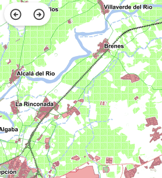

# M.plugin.ViewHistory

Plugin que permite navegar entre las vistas visitadas del mapa (retrocediendo y avanzando).



## Dependencias

- viewhistory.ol.min.js
- viewhistory.ol.min.css


```html
 <link href="../../plugins/viewhistory/viewhistory.ol.min.css" rel="stylesheet" />
 <script type="text/javascript" src="../../plugins/viewhistory/viewhistory.ol.min.js"></script>
```

## Ejemplos de uso

### Ejemplo 1
```javascript
  const map = M.map({
    container: 'map'
  });

  // crear el plugin
  const mp = new M.plugin.ViewHistory({
    position: 'TL'
  });

  // añadirlo al mapa
  map.addPlugin(mp);
  });
```
### Ejemplo 2
```javascript
   const map = M.map({
     container: 'map'
   });

   const mp = new M.plugin.ViewHistory();

   map.addPlugin(mp);
```

